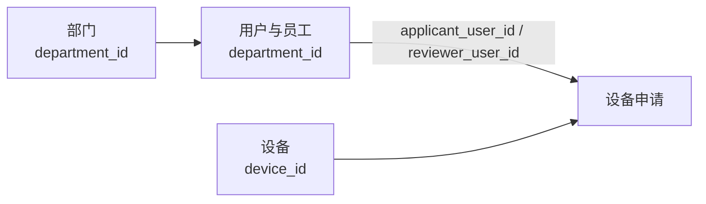

# Day05_综合案例：新员工助手Agent

> **本日定位**
>
> 前四天分别学习了身份与上下文、Tool 与运行控制、Trace 与调试、评估与回归。本日不再增加一批孤立的新概念，而是把这些能力与前面学过的 RAG 串成一个完整的单 Agent 项目。
>
> **一句话主线**：先独立验证带身份权限的公司知识库 RAG，再让一个 Agent 根据登录身份完成知识查询、找人办事、设备申请和 HR 审批。

## 学习目标

完成本项目后，能够：

1. 区分公司文档、部门目录、员工目录、设备目录和申请记录分别适合怎样保存和查询；
2. 处理普通文本、扫描件和图片资料，并验证 RAG 的原始证据、来源引用以及普通员工和 HR 的检索权限；
3. 把已验证的 RAG 和结构化查询能力注册为 Agent Tool；
4. 让 Agent 根据用户需求完成知识查询、部门查询、人员查询和找人办事；
5. 使用可信登录身份控制设备申请、申请查询与 HR 审批；
6. 对创建申请和审批等写操作执行参数检查、权限检查和人工确认；
7. 使用 Trace、业务事实和固定场景验收完整项目。

---

## 一、今天要实现什么项目

### 1.1 项目背景

新员工刚进入公司时，经常会遇到这些问题：

- 公司主要做什么业务？
- 请假、考勤和报销有什么规定？
- 公司有哪些部门，每个部门负责什么？
- 软件账号、报销或设备问题应该联系谁？
- 我可以申请哪些办公设备？
- 我的设备申请审批到哪一步了？

如果只做 RAG，它可以回答制度问题，却不能查询实时员工目录，也不能创建设备申请。如果只写普通业务程序，用户又必须记住每个菜单和操作入口。

本项目要实现一个“新员工助手 Agent”：员工使用自然语言提出需求，Agent 判断应该查询知识库、查询结构化数据，还是执行设备申请；HR 登录后，还可以查看并审批员工申请。

### 1.2 两种用户身份

本项目只保留两个角色：

| 角色  | 主要需求                            | 不能做什么                  |
| --- | ------------------------------- | ---------------------- |
| 新员工 | 查询公司与制度、找部门和联系人、查询设备、提交并查看自己的申请 | 查看 HR 专属资料、查看他人申请、审批申请 |
| HR  | 查询公共及 HR 专属资料、查找部门和人员、查看并审批设备申请 | 不能跳过业务规则直接修改申请结果       |

这里的“登录”是教学模拟：程序从预先登记的用户表中取得可信用户编号和角色。聊天中说“我是 HR”不能改变当前身份。

### 1.3 项目能力表

| 功能模块      | 新员工可以做什么            | HR 可以做什么                 | 数据来源或 Tool                   | 关键规则                            |
| --------- | ------------------- | ------------------------ | ---------------------------- | ------------------------------- |
| 用户登录      | 使用员工账号登录            | 使用 HR 账号登录               | 用户数据、登录入口                    | 登录后保存用户 ID、姓名、角色和部门             |
| 公司介绍查询    | 查询公司历史、文化、产品和办公地点   | 同样可以查询                   | 公共 RAG 文档                    | 回答应提供检索到的文档依据                   |
| 公共制度查询    | 查询考勤、请假、报销和办公规范等制度  | 同样可以查询                   | 公共 RAG 文档                    | 只回答知识库中能够找到依据的内容                |
| HR 专属制度查询 | 不允许查看               | 查询招聘录用、试用期和员工关系处理等 HR 文档 | 带权限标签的 RAG 文档                | 根据登录身份限制检索范围，不能把权限判断交给模型        |
| 部门查询      | 查看公司有哪些部门以及部门职责     | 同样可以查询                   | 部门查询 Tool                    | 返回部门名称、职责和办公位置等公开信息             |
| 人员查询      | 查看姓名、部门、岗位和办公联系方式   | 可以查看公开员工目录               | 员工目录 Tool                    | 不返回私人手机号、薪资等敏感信息                |
| 找人办事      | 询问“软件账号找谁”“报销找谁”等问题 | 同样可以使用                   | 知识库 Tool、部门查询 Tool、员工目录 Tool | 先确定负责部门，再查找对应联系人                |
| 可申请设备查询   | 查看电脑、显示器等可申请设备      | 查看设备目录                   | 设备查询 Tool                    | 只展示可申请选项，不模拟完整库存系统              |
| 创建设备申请    | 填写设备、数量和申请理由，确认后提交  | 本项目不要求 HR 代替员工提交         | 创建设备申请 Tool                  | 必须登录；创建前必须展示参数并确认               |
| 查看设备申请    | 只能查看自己的申请和审批结果      | 查看全部申请和待审批申请             | 申请查询 Tool                    | 员工不能查看其他人的申请                    |
| 审批设备申请    | 不允许审批               | 批准或拒绝申请，并填写审批意见          | 审批 Tool                      | 只有 HR 可以调用；只能审批待审批申请            |
| 申请状态管理    | 查看待审批、已批准、已拒绝状态     | 更新申请状态                   | 申请数据                         | 每次状态变化保存操作者、时间和原因               |
| 运行轨迹记录    | 无须直接操作              | 无须直接操作                   | Day03 观测中间件                  | 记录 Agent 查询了什么、调用了哪个 Tool、参数和结果 |
| 固定场景验证    | 完成员工侧测试场景           | 完成 HR 审批测试场景             | Day04 评测规则                   | 检查回答、检索权限、Tool、参数和业务结果          |

### 1.4 三条主要用户流程

第一条是知识查询：

员工登录 → 询问公司或制度 → Agent 检索当前身份有权查看的文档 → 根据证据回答并给出来源。

第二条是找人办事：

员工说明要办理的事情 → Agent 判断负责部门 → 查询部门信息 → 查询对应联系人 → 返回联系人和推荐理由。

第三条是设备申请与审批：

员工查询设备制度和可申请设备 → 提交设备、数量和理由 → 确认后生成待审批申请 → HR 登录并审批 → 员工查询审批结果。

### 1.5 本日交付物

项目完成后应交付：

- 一个可以独立验证的公司知识库 RAG；
- 一组带公共或 HR 权限标签的教学文档；
- 一个可以查询部门、人员和设备的结构化数据层；
- 一个支持员工与 HR 登录的新员工助手 Agent；
- 一条完整的设备申请与审批记录；
- 至少 8 条固定验收场景；
- 与验收场景对应的 Trace 和业务结果记录；
- 一份项目说明，解释各模块职责和失败排查顺序。

### 1.6 本日不展开什么

本项目不展开：

- FastAPI、Web 页面和移动端；
- 密码哈希、JWT、OAuth 等生产认证；
- 真实邮件、日历和企业通讯录接口；
- 真实设备库存、采购和资产发放；
- 薪资、考勤和请假等完整 HR 系统；
- 多 Agent、MCP 和远程 Tool；
- Docker、网络隔离和完整安全攻防；
- pytest 和持续集成。

教学项目使用虚构人员、虚构制度和本地数据。真实认证、数据库与接口授权留到第 16 周，Docker 和部署留到第 17 周。

---

## 二、先看懂项目数据和权限

这一章暂时不实现 RAG，也不编写 Agent。先把三个基础问题说清楚：

1. 哪些内容放进知识库，哪些内容保存为结构化业务数据；
2. 当前登录用户是什么身份；
3. 这个身份能够读取或修改哪些数据。

只有这三件事明确，后面的 RAG、Tool 和 Agent 才不会各自使用一套不同的规则。

### 2.1 先区分两类数据

本项目的数据分为两类：

| 数据类型 | 保存什么 | 主要处理方式 | 典型特点 |
| --- | --- | --- | --- |
| 知识文档 | 公司介绍、制度、操作说明、办公导览 | RAG | 内容较长，适合按语义寻找证据 |
| 结构化业务数据 | 用户、部门、设备、设备申请 | Tool | 字段明确，需要精确查询或修改 |

例如，员工问“我怎样申请显示器”时，Agent 可能同时使用两类数据：

- 先从知识库查询申请条件和审批流程；
- 再调用设备 Tool 查看当前允许申请的设备；
- 用户确认后，调用申请 Tool 写入一条业务记录。

因此，RAG 负责解释规则，Tool 负责读取或修改当前业务数据，两者不能互相替代。

### 2.2 登录身份从哪里来

`day05_users.json` 同时保存公开员工目录和教学登录账号。当前数据中共有 27 条人员记录，其中 10 条允许登录。课堂主线使用下面两个账号：

| 用户 | 登录账号 | 角色 | 部门 | 主要用途 |
| --- | --- | --- | --- | --- |
| 张伟 | `zhang_wei` | `employee` | 产品部 | 验证员工查询、申请和数据隔离 |
| 王芳 | `wang_fang` | `hr` | 人力资源部 | 验证 HR 专属检索和审批 |

程序完成登录后，从用户记录中取得可信的 `user_id`、`role` 和 `department_id`，再把它们放进运行上下文。用户在聊天中说“我是 HR”，不能改变已经登录的角色。

这里要区分：

- **人员记录**：表示公司里有哪些人；
- **登录账号**：表示哪些人员可以进入本教学程序；
- **角色**：表示登录用户属于 `employee` 还是 `hr`；
- **权限**：表示该角色具体允许执行哪些操作。

### 2.3 不同身份可以做什么

权限矩阵集中说明不同角色能够执行哪些操作：

| 操作 | 新员工 | HR |
| --- | ---: | ---: |
| 检索公司内公开文档 | 允许 | 允许 |
| 检索 HR 专属文档 | 拒绝 | 允许 |
| 查询部门和公开员工目录 | 允许 | 允许 |
| 查询可申请设备 | 允许 | 允许 |
| 创建设备申请 | 允许 | —（本项目不实现 HR 代申请） |
| 查看本人申请 | 允许 | 允许 |
| 查看全部申请 | 拒绝 | 允许 |
| 审批申请 | 拒绝 | 允许 |

可以把矩阵写成一份角色权限配置：

```python
ROLE_PERMISSIONS = {
    "employee": {  # 新员工角色拥有的权限
        "read_public_knowledge",       # 检索公司内公开知识文档
        "read_public_directory",       # 查询部门和公开员工目录
        "read_device_catalog",         # 查询可申请的设备
        "create_device_request",       # 创建设备申请
        "read_own_device_requests",    # 查看本人提交的申请
    },
    "hr": {  # HR 角色拥有的权限
        "read_public_knowledge",       # 检索公司内公开知识文档
        "read_hr_knowledge",           # 检索 HR 专属文档
        "read_public_directory",       # 查询部门和公开员工目录
        "read_device_catalog",         # 查询设备目录
        "read_all_device_requests",    # 查看全部申请，其中也包括 HR 本人的申请
        "review_device_requests",      # 批准或拒绝设备申请
    },
}
```

权限要在真正使用数据的位置执行：

- RAG 检索前，根据可信登录角色过滤允许进入候选集合的文档；
- Tool 查询前，判断用户能够查看本人记录还是全部记录；
- Tool 写入前，再检查创建或审批权限；
- Prompt 可以提醒模型遵守规则，但不能代替程序检查。

### 2.4 知识库资料怎样组织

知识库位于 `day05/knowledge/`，由 `day05_knowledge_manifest.json` 统一登记。这里的 `public` 表示“公司内部公开”，并不表示互联网匿名用户可以访问。

| 文档编号 | 资料 | 格式 | 访问范围 |
| --- | --- | --- | --- |
| KB-PUB-001 | 公司介绍与办公指南 | Markdown | 公司内公开 |
| KB-PUB-002 | 新员工常见问题 | TXT | 公司内公开 |
| KB-PUB-003 | 员工手册 | DOCX | 公司内公开 |
| KB-PUB-004 | 办公设备申请与审批制度 | PDF | 公司内公开 |
| KB-PUB-005 | 常用系统与账号使用指南 | HTML | 公司内公开 |
| KB-PUB-006 | 费用报销填写说明扫描件 | 扫描 PDF | 公司内公开 |
| KB-PUB-007 | 北京总部十层办公区导览图 | PNG | 公司内公开 |
| KB-PUB-008 | 账号与数据安全宣传海报 | JPEG | 公司内公开 |
| KB-HR-001 | 招聘录用与试用期操作规范 | DOCX | 仅 HR |
| KB-HR-002 | 员工关系问题处理指引 | PDF | 仅 HR |

清单中的字段分为三类：

| 类型 | 主要字段 | 作用 |
| --- | --- | --- |
| 文档身份 | `document_id`、`path`、`title`、`file_type`、`version` | 确定是哪一份资料及其版本 |
| 访问控制 | `access_scope`、`allowed_roles`、`status` | 说明资料范围、允许角色和是否生效 |
| 解析提示 | `parser_mode` | 提示后续使用普通解析、OCR 或多模态处理 |

`access_scope` 用于说明和展示资料范围，程序执行过滤时以 `allowed_roles` 为准。目录名只用于整理文件，不能代替权限字段。

原始文档还没有 `chunk_id`。文档切分后，每个 Chunk 再增加自己的 `chunk_id` 和 `content`，同时继承原文档的 `document_id`、标题、路径、版本、状态和 `allowed_roles`。第三章再具体处理不同格式、OCR 和多模态资料。

### 2.5 四份业务 JSON 怎样关联

结构化业务数据位于 `day05/`：

| 文件 | 保存什么 |
| --- | --- |
| `day05_users.json` | 登录身份和公开员工目录 |
| `day05_departments.json` | 部门职责、办公位置和公共联系方式 |
| `day05_devices.json` | 可申请设备、适用范围和数量限制 |
| `day05_device_requests.json` | 待审批、已批准和已拒绝的设备申请 |

四份数据通过稳定编号关联：



读取申请记录时，不要只展示编号。程序应使用：

- `applicant_user_id` 到用户数据中查申请人；
- `reviewer_user_id` 到用户数据中查审批人；
- `device_id` 到设备数据中查设备；
- 用户的 `department_id` 到部门数据中查部门。

这样可以避免在多个文件中重复保存姓名、部门名和设备名。完整字段说明放在文末“附录 A：配套 JSON 字段速查”，需要实现对应数据时再查阅。

### 2.6 开始开发前先检查

进入第三章前，先完成下面的静态检查：

- 四份业务 JSON 都能被正常解析；
- 用户、部门、设备和申请编号没有重复；
- 每个 `department_id`、`device_id` 和用户编号都能找到对应记录；
- 知识库清单中的文件路径全部存在；
- 每份知识文档都有稳定编号、版本、状态和 `allowed_roles`；
- 公司内公开资料允许 `employee` 和 `hr` 访问；
- HR 专属资料只允许 `hr` 访问；
- 用户记录只保存 `role`，不为每个用户重复保存权限列表。

本章结束后，我们已经知道“数据在哪里、怎样关联、谁能访问”。第三章只解决下一件事：怎样把当前身份有权访问的文档做成可验证的 RAG。

---

## 三、第一部分：完成带权限的独立 RAG

### 3.1 准备并检查文档

先读取 `day05/knowledge/day05_knowledge_manifest.json`，确认清单中的路径都存在，并检查每份文档是否具有正文、标题、版本、来源和允许访问角色。公共文档和 HR 文档都包含可以提出明确问题的内容，不是占位文件。

不要一开始就要求同一个 Loader 处理全部格式。先按 `parser_mode` 分流：

- `text`、`document_text`、`pdf_text` 和 `html_text`：使用与格式匹配的普通解析器提取文字；
- `ocr_required`：普通解析拿不到正文时转交 OCR，不要把“没有文字”误判为“文档为空”；
- `multimodal_required`：把图片交给支持图像输入的模型，保留位置、方向、颜色和箭头等视觉关系；
- `ocr_or_multimodal`：可以先用 OCR 获取文字，也可以让多模态模型结合版面理解。

OCR 和多模态模型输出都是机器识别结果，不应自动当成原始事实。至少抽查标题、关键数字、方向关系和文档编号；解析失败时保留错误和原文件，不把失败样本静默丢弃。

本步骤的可观察结果是：能够列出所有文档，清楚看到访问范围和计划使用的解析方式，并验证扫描 PDF 没有可直接提取的正文。

### 3.2 切分文档并保留权限

文档切分后，来源、版本和允许访问角色必须继续保留在每个 Chunk 中。抽查切分结果，确认正文没有被错误截断，权限字段没有丢失。

权限属于文档数据合同，不能通过目录名或文件名猜测，也不能让模型从正文判断。图片经过 OCR 或多模态模型得到的文字，也必须继承原文档的 `document_id`、`allowed_roles`、版本和来源。

### 3.3 建立向量索引

按照前课已经学过的方式生成 Embedding 并写入本地向量索引。记录实际使用的知识库版本、Embedding 模型、文档数量、Chunk 数量和索引位置。

课件不提供固定数量或固定准确率。所有结果都应来自学生自己的实际运行。

### 3.4 先查看原始检索证据

独立检索入口至少接收登录身份和问题，并展示：

- 证据排名；
- 文档标题和来源；
- Chunk 编号；
- 文档访问范围；
- 实际证据文本。

先验证证据，再验证模型回答。尤其要比较同一个 HR 问题在张伟和王芳身份下的结果。

### 3.5 再生成带引用回答

检索正确后，再把当前身份有权查看的证据交给模型。模型只能根据这些证据回答；来源列表由程序根据真实检索结果生成，不能让模型编造来源。

证据不足时，应明确说明无法从当前知识库确认，并提示用户联系合适部门，而不是凭模型常识补写公司制度。

### 3.6 独立 RAG 的通过标准

- 公司介绍问题能够召回公司介绍文档；
- 公共制度问题能够找到对应条款和来源；
- 扫描版报销说明经过 OCR 后能够识别标题和关键字段，且结果明确标注为识别文本；
- 办公区导览图能够回答至少一个需要理解位置或路线的问题，而不只是抄出图片文字；
- 张伟检索不到 HR 专属正文；
- 王芳能够检索到授权范围内的 HR 文档；
- 切换用户消息中的自报身份不会改变检索范围；
- 没有证据时不会编造制度；
- 回答中的关键结论可以在证据中找到。

完成以上检查后，才把检索能力注册为 Agent Tool。

---

## 四、第二部分：完成只读查询与找人办事

### 4.1 设计最小 Tool 集合

建议先实现这些只读能力：

| Tool 能力 | 输入重点 | 返回重点 |
| --- | --- | --- |
| 查询公司知识 | 自然语言问题 | 当前身份有权查看的证据和来源 |
| 查询部门 | 部门名称或职责关键词 | 部门编号、名称、职责和位置 |
| 查询员工 | 姓名、部门或岗位 | 公开姓名、部门、岗位和办公联系方式 |
| 查询设备 | 设备类型或全部可申请设备 | 稳定设备编号、名称和申请限制 |

Tool 返回结构化结果，Agent 负责把结果组织成自然语言。Tool 不应根据聊天中的“我是 HR”改变权限。

### 4.2 部门和员工为什么不直接用 RAG

“报销制度怎么规定”适合语义检索；“产品部有哪些公开联系人”需要精确筛选。将部门和员工目录放在结构化数据中，可以避免漏人、重复和字段不一致。

员工目录 Tool 还可以统一删除不应展示的字段，使模型根本接触不到私人信息。

### 4.3 实现找人办事

面对“软件账号应该找谁”这类问题，Agent 可以按以下顺序处理：

1. 理解用户要办理的事情；
2. 查询制度或部门职责，确定负责部门；
3. 使用部门编号查询公开联系人；
4. 返回联系人、岗位、办公联系方式和推荐理由。

如果无法确定负责部门，应说明缺少依据或继续询问，不能随意推荐一个员工。

### 4.4 只读能力的通过标准

- 能准确列出公司部门；
- 能按部门、姓名或岗位查询公开人员；
- 不返回目录中未公开的字段；
- “找人办事”能够说明负责部门和联系人；
- Tool 无结果时，Agent 不编造部门或员工；
- 普通知识问题不会错误调用员工目录；
- 人员查询不会错误调用 RAG 代替精确目录。

---

## 五、第三部分：完成设备申请和 HR 审批

### 5.1 设备申请的业务状态

正式申请只使用三个状态：

| 状态 | 含义 | 允许的下一步 |
| --- | --- | --- |
| 待审批 | 员工已经确认并提交 | HR 批准或拒绝 |
| 已批准 | HR 已同意 | 本项目到此结束 |
| 已拒绝 | HR 已拒绝 | 本项目到此结束 |

人工确认前保存的内容只是“待确认候选”，还不是正式设备申请。员工确认后，系统才创建一条待审批记录。

“已批准”也不表示设备已经采购或发放。本项目不扩展库存和资产交付流程。

### 5.2 创建设备申请

创建申请至少需要设备编号、数量和申请理由。执行顺序是：

1. 从运行上下文读取可信用户；
2. 检查当前角色是否允许提交；
3. 检查设备是否存在并允许申请；
4. 检查数量和理由；
5. 生成待确认候选；
6. 向员工展示本次具体参数；
7. 员工明确确认后创建待审批记录；
8. 返回真实申请编号和状态。

用户拒绝确认时不得产生正式申请。相同候选重复恢复时，不应重复创建两条申请。

### 5.3 查询设备申请

申请查询 Tool 根据登录身份自动限制范围：

- 新员工只能查看自己的申请；
- HR 可以查看全部申请，也可以只查看待审批申请。

用户编号来自运行上下文，不允许模型提供任意用户编号来查询他人数据。

### 5.4 HR 审批申请

审批至少需要申请编号、决定和审批意见。拒绝时必须提供原因。审批前向 HR 展示具体申请和决定，并要求确认。

真正更新状态的位置必须再次检查：

- 当前角色是否为 HR；
- 申请是否存在；
- 当前状态是否仍为待审批；
- 本次决定是否合法；
- 同一审批操作是否已经执行。

Prompt 中写“只有 HR 可以审批”只是行为提示，不能代替 Tool 内的权限检查。

### 5.5 写操作的通过标准

- 员工确认前不产生正式申请；
- 员工确认后新增一条待审批申请；
- 员工只能看到自己的申请；
- 员工尝试审批时执行端明确拒绝；
- HR 可以查看待审批申请；
- HR 确认后申请变为已批准或已拒绝；
- 已完成申请不能重复审批；
- Agent 的最终回答与真实申请状态一致。

---

## 六、第四部分：组装新员工助手 Agent

### 6.1 Agent 拥有哪些能力

完整 Agent 可以使用：

1. 查询公司知识；
2. 查询部门；
3. 查询公开员工目录；
4. 查询可申请设备；
5. 创建设备申请；
6. 查询设备申请；
7. 审批设备申请。

这是一个单 Agent 项目。不同 Tool 不等于多个 Agent。

### 6.2 Agent 应遵守的行为规则

- 公司介绍和制度问题先查询知识库；
- 部门和人员信息使用结构化查询；
- 找人办事时先确定负责部门，再查询联系人；
- 申请设备前先查询可用设备和申请规则；
- 缺少设备、数量或理由时继续询问；
- 创建申请和审批申请前展示具体参数并确认；
- 身份和权限只相信运行上下文；
- 只能根据 Tool 的真实结果报告成功；
- Tool 返回无结果时不得编造数据；
- 一次先处理一个 Tool 结果，再决定下一步。

### 6.3 完整应用入口

学生最终运行一个统一入口：

1. 选择教学账号并建立会话；
2. 程序把可信身份写入运行上下文；
3. 用户输入自然语言需求；
4. Agent 选择 RAG 或业务 Tool；
5. 写操作需要时进入人工确认；
6. Tool 返回真实结果；
7. Agent 组织最终回答；
8. 程序保存 Trace 和业务事实；
9. 用户可以继续对话或退出。

独立 RAG 入口继续保留，用于验证检索和排错；它不是第二个面向最终用户的产品。

### 6.4 典型完整流程

员工侧：

张伟登录 → 查询设备申请制度 → 查看可申请设备 → 提交“显示器、1 台、用于双屏办公” → 确认 → 得到待审批申请编号。

HR 侧：

王芳登录 → 查看待审批申请 → 查看张伟的申请内容 → 选择批准或拒绝 → 确认 → 申请状态发生变化。

员工再次登录：

张伟查询自己的申请 → 看到真实审批结果和 HR 意见。

---

## 七、接入 Trace 和固定场景验收

### 7.1 Trace 至少记录什么

每次任务至少记录：

- 运行配置和脱敏后的登录身份；
- 用户消息、Agent 消息和 Tool 结果顺序；
- Tool 名称、参数、状态和错误码；
- RAG 返回的文档编号与来源；
- 是否进入人工确认以及确认决定；
- 最终运行状态和停止原因；
- 申请编号、状态变化等业务事实。

Trace 中不得保存 API Key、密码和不必要的个人信息。HR 专属正文是否保存到教学 Trace，应根据教学数据范围决定；至少可以保存文档编号、访问结果和脱敏摘要。

### 7.2 固定验收场景

本次不预置验收 JSON。完成 Agent、确认真实 Tool 名称和返回字段后，再把下面的场景整理成 Day04 风格的固定测试集，避免测试合同先于实现而反复修改。

| 场景 | 登录身份 | 输入或操作 | 预期结果 | 主要证据 |
| --- | --- | --- | --- | --- |
| 查询公司介绍 | 张伟 | 公司主要做什么业务？ | 调用知识库并给出来源 | 检索文档、Tool 轨迹、引用 |
| 查询公共制度 | 张伟 | 报销需要哪些材料？ | 返回公共制度证据 | 来源和最终回答 |
| 员工查询 HR 文档 | 张伟 | 试用期中期回顾需要保留哪些记录？ | 不返回 HR 专属正文 | 检索过滤结果和角色 |
| HR 查询专属文档 | 王芳 | 试用期中期回顾需要保留哪些记录？ | 返回授权证据和来源 | 文档权限、来源和回答 |
| 找人办事 | 张伟 | 软件账号开通应该找谁？ | 找到负责部门和公开联系人 | 部门 Tool、员工 Tool |
| 创建设备申请 | 张伟 | 申请一台显示器并确认 | 新增一条待审批申请 | 候选、确认、申请编号 |
| 员工越权审批 | 张伟 | 批准自己的设备申请 | 执行端拒绝，状态不变 | 错误码和业务事实 |
| HR 批准申请 | 王芳 | 批准指定待审批申请并确认 | 状态变为已批准 | 审批 Tool 和状态变化 |
| HR 拒绝申请 | 王芳 | 拒绝指定申请但不提供原因 | 要求补充拒绝原因，不更新状态 | 参数检查和业务事实 |
| 查看申请隔离 | 张伟 | 查询自己的申请 | 只返回张伟的申请 | 查询条件和返回记录 |

上述是预期设计，不是已经运行得到的结果。学生需要记录真实结果并逐条判断。

### 7.3 分四层判断是否通过

| 检查层 | 核心问题 |
| --- | --- |
| 任务层 | 用户的问题或操作是否得到正确处理？ |
| Agent 层 | 是否选择了正确 Tool，参数是否合理？ |
| 控制层 | 身份、RAG 权限、业务权限和确认是否真正生效？ |
| 业务层 | 返回的证据、申请记录和状态是否符合预期？ |

最终回答看起来正确，不代表整条任务通过。例如张伟得到了合理的 HR 制度回答，但 Trace 表明模型没有授权证据，这仍然属于失败。

### 7.4 从失败结果回到证据

建议按下面的顺序排查：

| 现象 | 优先检查 |
| --- | --- |
| 回答没有依据或引用错误 | 独立 RAG 的原始证据 |
| 员工检索到 HR 文档 | 登录身份、Chunk 权限和检索过滤条件 |
| 找错联系人 | 部门职责数据、部门查询和员工查询结果 |
| 申请参数错误 | Agent Tool Call 和参数校验 |
| 越权操作成功 | Tool 执行端的身份与权限检查 |
| 确认后重复创建 | 候选编号、会话状态和幂等记录 |
| 最终回答与状态不同 | Tool 结果、业务数据和 Trace |

Day03 负责解释一条 Trace，Day04 提供固定场景和比较口径。本日直接复用这两种能力，不再实现一套新的观测或评测平台。

---

## 八、按阶段完成项目

不要一次性把所有功能写完。每个阶段只增加一组相关能力，并留下可观察结果。

| 阶段 | 本阶段完成什么 | 必须观察什么 | 通过后进入 |
| --- | --- | --- | --- |
| 1 | 准备公共与 HR 文档 | 正文、来源、版本和允许角色 | 文档切分 |
| 2 | 切分并建立向量索引 | Chunk 内容、来源和权限继承 | 独立检索 |
| 3 | 独立验证 RAG | 原始证据、引用、无证据回答和角色差异 | RAG Tool |
| 4 | 准备部门、人员和设备数据 | 字段、编号和敏感字段边界 | 只读 Tool |
| 5 | 完成部门、人员和设备查询 | 精确返回、无结果和字段过滤 | 找人办事 |
| 6 | 完成找人办事 | 负责部门、联系人和推荐依据 | 设备申请 |
| 7 | 完成设备申请 | 候选、确认、申请编号和待审批状态 | HR 审批 |
| 8 | 完成申请查询和审批 | 数据隔离、角色权限和状态变化 | Agent 组装 |
| 9 | 组装统一单 Agent | Tool 选择、追问和完整对话 | Trace |
| 10 | 接入 Trace 和固定场景 | 运行轨迹、业务事实和通过结论 | 项目交付 |

某一阶段未通过时，不继续叠加下一层。例如员工能够检索 HR 文档时，应先修复 RAG 权限，不要依靠最终回答隐藏正文。

---

## 九、常见问题

### 9.1 把所有数据都做成 RAG

制度文档适合语义检索，员工目录和申请状态需要精确查询。混在一起会让结果不完整，也很难正确更新状态。

### 9.2 检索后才让模型判断权限

一旦无权正文进入模型上下文，就已经突破了检索边界。应用应在检索时根据可信角色限制候选文档。

### 9.3 只在 Prompt 中写“员工不能审批”

Prompt 只能影响模型行为，不能成为最终权限控制。即使模型错误调用审批 Tool，执行端也必须拒绝。

### 9.4 Agent 编造不存在的员工

联系人必须来自员工目录 Tool 的真实结果。没有匹配人员时，应说明未找到或推荐联系部门公共入口。

### 9.5 批准申请等同于设备已发放

本项目只完成申请审批。资产采购、库存占用、领用和归还属于后续业务，不应在没有实现时声称完成。

### 9.6 模型说“成功”就算业务成功

必须检查申请记录和状态是否真的变化。最终回答、Tool 结果和业务事实三者一致，才能判定成功。

---

## 十、项目完成标准

### 10.1 功能完成标准

- 独立 RAG 可以展示原始证据、来源和带引用回答；
- 普通员工与 HR 的检索范围不同，并由程序侧身份控制；
- Agent 可以正确选择知识、部门、人员、设备和申请 Tool；
- 找人办事能够给出负责部门和真实联系人；
- 员工可以确认后创建设备申请并查看自己的记录；
- HR 可以查看待审批申请并批准或拒绝；
- 员工不能查看他人申请或执行审批；
- 写操作具备参数检查、人工确认和幂等边界；
- 每条固定场景都有真实结果、Trace 和业务证据。

### 10.2 理解完成标准

完成项目后，应能够用自己的话说明：

1. 为什么制度文档使用 RAG，而人员和申请使用结构化 Tool；
2. 为什么 RAG 要先独立验证再接入 Agent；
3. 为什么 HR 文档必须在检索阶段执行权限过滤；
4. 为什么身份不能来自用户聊天内容；
5. 为什么创建申请和审批都需要执行端检查；
6. 为什么模型回答成功不等于业务成功；
7. 出现错误时怎样从 RAG、Tool、Trace 和业务数据缩小范围。

### 10.3 允许的教学简化

本项目可以使用：

- JSON 教学用户表；
- 本地文档和本地 Chroma；
- JSON 或进程内部门、人员、设备和申请数据；
- 内存 Checkpointer；
- 命令行交互；
- 虚构公司、虚构制度、虚构人员和虚构申请。

这些是当前阶段的教学方案，不等于生产实现。

---

## 十一、知识点总结与知识树

### 11.1 核心结论

1. RAG 负责从文档中找证据，结构化 Tool 负责精确业务数据。
2. Agent 负责理解需求和选择能力，不负责自行决定权限。
3. 登录身份由应用提供，RAG 和业务 Tool 都从运行上下文读取身份。
4. HR 专属文档必须在检索阶段过滤，不能只依赖模型拒答。
5. 创建和审批是两次独立写操作，都需要参数、权限和确认。
6. Trace 说明过程，业务数据证明真实结果，固定场景判断项目是否通过。

### 11.2 知识树

新员工助手 Agent

- 公司知识 RAG
  - 公共文档
  - HR 专属文档
  - Chunk 权限元数据
  - 原始证据验证
  - 带引用回答
- 结构化查询
  - 部门目录
  - 员工公开目录
  - 设备目录
  - 找人办事
- 设备申请闭环
  - 待确认候选
  - 员工确认提交
  - 待审批申请
  - HR 批准或拒绝
  - 申请查询隔离
- 单 Agent 工程能力
  - 可信身份
  - Runtime Context
  - Tool 合同
  - 人工确认
  - Checkpoint 与幂等
  - Trace 与业务事实
  - 固定场景验收

---

## 十二、扩展任务

扩展功能必须建立在核心流程通过之后。

### 12.1 基础扩展：增加新的制度文档

增加一份公共制度和一份 HR 专属制度，完成权限标注、入库、原始证据检查和角色差异验证。

### 12.2 综合扩展：增加联系人兜底

当没有找到具体员工时，返回部门公共联系方式，并在结果中明确说明“未找到公开的具体联系人”，不得编造姓名。

### 12.3 选做扩展：允许员工撤回申请

只允许申请人在待审批状态下撤回。设计状态变化、权限、确认、幂等和固定验收场景，不扩展设备库存。

---

## 十三、参考资料与后续课程

### 13.1 参考资料

- [LangChain Chroma integration](https://docs.langchain.com/oss/python/integrations/vectorstores/chroma)
- [Chroma metadata filtering](https://docs.trychroma.com/docs/querying-collections/metadata-filtering)
- [LangChain Tools](https://docs.langchain.com/oss/python/langchain/tools)
- [LangChain Runtime Context](https://docs.langchain.com/oss/python/langchain/runtime)
- [LangChain custom middleware](https://docs.langchain.com/oss/python/langchain/middleware/custom)

框架接口和依赖版本可能变化。正式实现时，应根据课程统一环境和开课当季官方资料复核 Agent、Tool、Runtime Context、Middleware、Chroma 与 Embedding 的集成方式。

### 13.2 后续课程怎样继续

第 15 周进入多 Agent 与 MCP。本项目首先作为单 Agent 基线，只有在职责拆分确有必要时，才讨论是否把知识服务、员工服务或审批流程拆开。

第 16 周可以把教学登录、JSON 数据和命令行入口升级为认证授权、数据库和 FastAPI；第 17 周再补充 Docker、部署、运行隔离、CI 和发布门禁；后续综合项目阶段再进行提示词注入、越权和数据泄露等安全验收。


---

## 附录 A：配套 JSON 字段速查

本附录用于实现结构化 Tool 时查阅字段，不属于第二章必须连续讲授的主线。先理解第二章的数据关系，需要实现某个文件时再查看对应示例。

下面使用接近 JSON 的展示形式解释字段，并在每个字段后保留 `//` 教学注释。标准 JSON 不支持注释；复制到程序中运行时需要先删除注释。`day05/` 目录中的真实 JSON 文件不包含注释。

### A.1 `day05_users.json`

这个文件是唯一的人员数据源，同时保存员工目录和登录信息。登录时筛选 login_enabled 为 true 且 account_status 为 active 的记录；找人时筛选 is_public 为 true 的记录。

```json
{
  "dataset_name": "day05_users", // 数据集名称
  "dataset_version": "2.1", // 删除重复权限字段后的数据版本
  "users": [ // 全部人员记录
    {
      "user_id": "USR-001", // 稳定用户编号，跨文件关联时使用
      "username": "zhang_wei", // 登录账号；不能登录时为 null
      "display_name": "张伟", // 界面展示的中文姓名
      "role": "employee", // 登录角色；不能登录时为 null
      "login_enabled": true, // 是否允许使用该记录登录
      "account_status": "active", // 账号状态；不能登录时为 null
      "department_id": "DEPT-PRODUCT", // 所属部门编号
      "job_title": "产品助理", // 岗位名称
      "expertise": ["需求整理", "用户反馈"], // 主要负责事项
      "office_location": "北京总部 10 层", // 办公地点
      "office_contact": "zhang.wei@example.com", // 办公邮箱
      "is_public": true // 是否允许普通员工查询此人
    }
  ]
}
```

`day05_users.json` 不保存 `permissions`。程序读取登录用户的 `role` 后，再从 2.3 的 `ROLE_PERMISSIONS` 获取对应权限。

只有通讯录记录、没有教学登录账号的人员使用 username、role 和 account_status 为 null，login_enabled 为 false。

### A.2 `day05_departments.json`

这个文件表示“公司有哪些部门，每个部门负责什么”。

```json
{
  "dataset_name": "day05_departments", // 数据集名称
  "dataset_version": "1.1", // 数据版本
  "departments": [ // 部门列表
    {
      "department_id": "DEPT-IT", // 稳定部门编号
      "name": "信息技术部", // 部门名称
      "responsibilities": [ // 负责事项，用于“找人办事”
        "软件账号", // 软件系统账号问题
        "公司邮箱", // 企业邮箱问题
        "VPN" // 远程访问问题
      ],
      "office_location": "北京总部 10 层", // 办公地点
      "public_contact": "it-service@example.com" // 部门公共邮箱
    }
  ]
}
```

### A.3 `day05_devices.json`

这个文件表示“有哪些设备，以及谁可以申请”。

```json
{
  "dataset_name": "day05_devices", // 数据集名称
  "dataset_version": "1.1", // 数据版本
  "devices": [ // 设备目录列表
    {
      "device_id": "DEV-LAPTOP-PRO", // 稳定设备编号
      "name": "高性能开发笔记本", // 设备名称
      "category": "电脑", // 设备分类
      "description": "适用于软件开发和数据处理。", // 设备用途
      "eligible_roles": ["employee"], // 允许申请的角色
      "eligible_department_ids": ["DEPT-RND", "DEPT-IT"], // 允许申请的部门
      "max_quantity_per_request": 1, // 单次申请数量上限
      "request_requirements": "说明岗位和性能需求。", // 申请理由要求
      "is_requestable": true // 当前是否开放申请
    }
  ]
}
```

eligible_department_ids 为空不等于禁止申请。是否可以申请还要同时检查角色、is_requestable 和数量限制。

### A.4 `day05_device_requests.json`

这个文件保存已经提交的设备申请，用于练习本人查询、HR 查询和审批。

```json
{
  "dataset_name": "day05_device_requests", // 数据集名称
  "dataset_version": "1.1", // 数据版本
  "requests": [ // 已提交的设备申请列表
    {
      "request_id": "REQ-2026-0001", // 稳定申请编号
      "applicant_user_id": "USR-001", // 申请人的 user_id
      "device_id": "DEV-MONITOR-24", // 申请设备的 device_id
      "quantity": 1, // 申请数量
      "reason": "需要双屏查看原型和需求文档。", // 申请理由
      "status": "pending", // pending 待审批、approved 已批准、rejected 已拒绝
      "requested_at": "2026-09-15T09:30:00+08:00", // 提交时间和时区
      "reviewer_user_id": null, // 审批人；未审批时为 null
      "reviewed_at": null, // 审批时间；未审批时为 null
      "review_comment": null // 审批意见；未审批时为 null
    }
  ]
}
```

pending 表示待审批，approved 表示已批准，rejected 表示已拒绝。已批准或已拒绝的记录不能再次审批。
